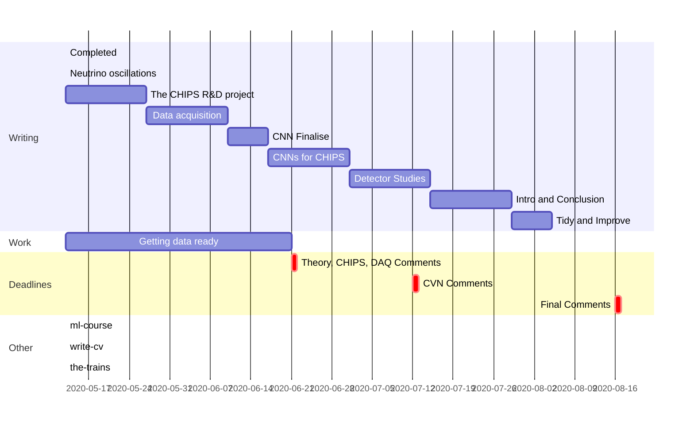

# 0-plan

- Keep the gantt chart updated as progress is made
- Under each chapter heading have the following
  - Rough length chapter will be
  - Goal statement for the chapter
  - Sub-sections (if any) and a brief description for each
  - Diagrams in their sub-sections
  - References in their sub-sections

## Frontmatter (~?)

## Introduction and Authors Contribution (~5)

## Neutrino oscillations: theoretical background and current status (~30)

## The CHIPS R&D project (~20)

## Data acquisition for CHIPS (~20)

## A Convolutional neural network for CHIPS (~50)

## Detector optimisation for CHIPS (~20)

## Conclusion (~5)

## Appendices (~?)
