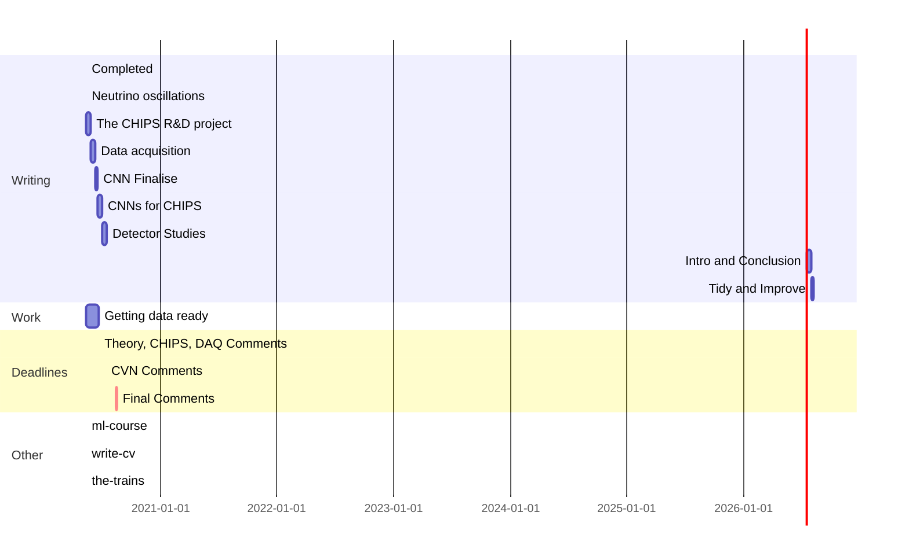

# Plan

- Keep the gantt chart updated as progress is made
- Under each chapter heading have the following
  - Rough length chapter will be
  - Goal statement for the chapter
  - Sub-sections (if any) and a brief description for each
  - Diagrams in their sub-sections
  - References in their sub-sections

## Frontmatter (~?)

## Introduction and Authors Contribution (~5)

## Neutrino oscillations: theoretical background and current status (~30)

## The CHIPS R&D project (~20)

## Data acquisition for CHIPS (~20)

## A Convolutional neural network for CHIPS (~50)

- [ ] Comparing nuel, anuel, numu and anumu CHIPS flux energy distributions (flux_type_comparison.png) (flux.py)
- [ ] Comparing CHIPS, MINOS and NOvA flux energy distributions (flux_detector_comparison.png) (flux.py)
- [ ] Numu left(CC), right(NC) cross-sections as implemented by GENIE vs energy (xsec_numu.png) (xsec.py)
- [ ] Numu vs anumu, CC vs NC cross-sections as implemented by GENIE vs energy (xsec_numu_vs_anumu.png) (xsec.py)

- [Visualizing and Understanding Convolutional Networks](https://arxiv.org/pdf/1311.2901.pdf) [1311.2901](@note/1311.2901.md)
- [Visualizing Data using t-SNE](http://www.jmlr.org/papers/volume9/vandermaaten08a/vandermaaten08a.pdf) [vandermaaten08a](@note/vandermaaten08a.md)

## Detector optimisation for CHIPS (~20)

You have all of these possible parameters that can affect the performance (event categorisation and kinematic reconstruction) of your WC detector
- Positioning of the detector (L, angle off-axis, overburden) *
- Size of the detector (height and radius) *
- Water quality (attenuation length, scattering vs absorption) *
- Which PMT’s you use (time resolution, charge collection) *
- How the PMT’s are positioned (percentage coverage, zones)
- Calibration quality (position, time, charge)
- Reconstruction methodology (likelihood vs CNN)

Given these restrictions
- Only certain mine pits usable (fixes L and angle off-axis, use all overburden available)
- 12.5m radius for practical construction (fixes radius, but not height)
- Want to be able to carry the planes easily (Adds limits to PMT coverage percentage)
- Will just be looking at beam events, should not need much in the back
- PMT’s available. Due to cost etc… we fix the PMT’s we use, can still explore this space with varying the time/charge.

Can look at 
- Detector height *
- Water Quality *
- How the PMT’s are positioned (can fix percentage coverage due to practical plane restriction)
- Calibration Quality (network ensamble)
- Reconstruction Methodology

Generation Parameters
- Input beam flux (Use the ones I now have from Anna)
- Oscillated beam flux (Use the one I now have)
- Cross section splines (Use the ones I have always had, they should be good)
- Generation energy range (0-15GeV, this definitely covers the full range of energies) 
- Fraction of H and O in water (Just keep the 95% to 5% we have always had, SuperK use)
- Type of events to generate (Decide on the categories)

Simulation Parameters
- Physics List (Negligable changes, therefore, use QGSP_BIC_HP as preferred for energies below 5 GeV)
- PMT QE Option (Negligible changes, therefore, use stacking-only )
- Absorption Length Scaling (Something to study, need default)
- Reflectivity of glass cathode (0.24) 
- Rayleigh scattering length Scaling (Something to study, need default)
- Blacksheet reflectivity Scaling (0.7)
- Mie scattering length Scaling (0.0, it’s not important as Maciej found out)
- Geometry definition (Something to study, need default)
- PMT definition (Think they are pretty good already, use them)
- Light Cone definition (Think this is pretty good already use it)
- Fiducial generation distance (Set to 1m, higher density in middle and can explore edge)
- PMT digitisation simulation (Decide with Paul, just use hits for now!!!)
- PMT angular collection efficiency (Keep it as the one Paul suggested, mainly 100%)

## Conclusion (~5)

## Appendices (~?)
